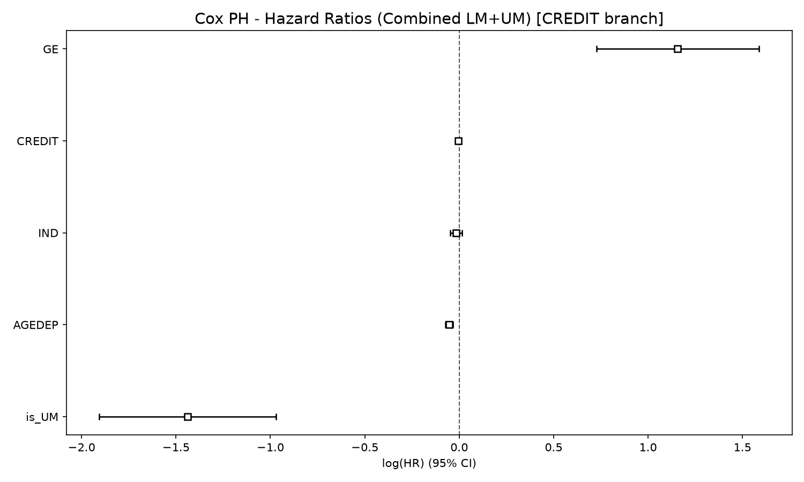
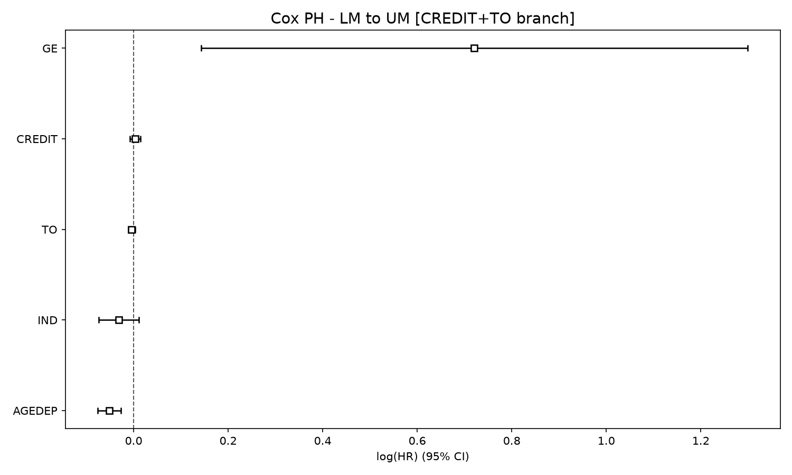
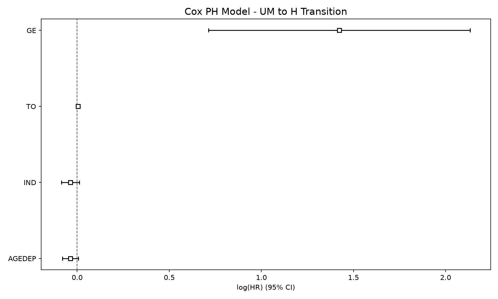
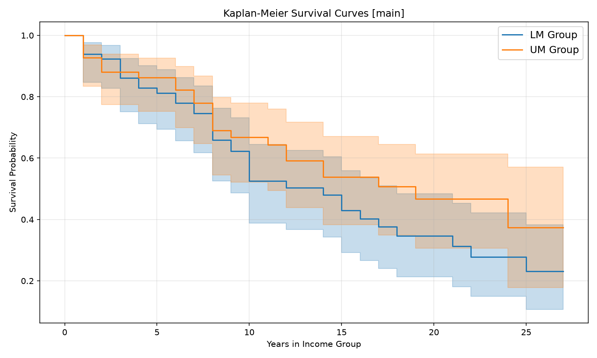

# Kết quả mô hình Cox Proportional Hazards - Main

**Branch:** `main`  
**Biến:** `TFP`, `GE`, `AGEDEP`, `IND`, `TO`, `CREDIT`, `ECI`  
**Dữ liệu:** 2000-2026  
**Phương pháp:** counting-process Cox PH, robust SE clustered theo `Code`

## 1. Survival sample

| Chỉ số | Giá trị |
|---|---:|
| Quan sát | 1,404 |
| Spells | 135 |
| LM spells | 66 |
| LM events | 38 |
| UM spells | 69 |
| UM events | 26 |
| Tổng events | 64 |
| Censored | 71 |

Chỉ giữ hai transition `LM -> UM` và `UM -> H`. Các bước nhảy `LM -> H` bị loại khỏi mẫu.

## 2. Kết quả toàn bộ mô hình

### Combined LM + UM

| Biến | Hazard ratio | p-value |
|---|---:|---:|
| TFP | 5.63 | 0.176 |
| GE | 2.38 | 0.077 |
| AGEDEP | 0.95 | 0.015 |
| IND | 0.94 | 0.142 |
| TO | 1.00 | 0.567 |
| CREDIT | 0.99 | 0.263 |
| ECI | 2.21 | 0.081 |
| is_UM | 0.23 | 0.005 |

Concordance: `0.77`; partial AIC: `498.45`.

**Giải thích:** Điểm là log hazard ratio, thanh ngang là khoảng tin cậy 95%, đường dọc tại 0 là mốc không tác động. GE và ECI nằm phía dương, AGEDEP và `is_UM` phía âm. Tuy nhiên, ở mô hình combined chỉ AGEDEP và `is_UM` có p-value dưới 0.05; GE và ECI mới ở mức biên.

## 3. Mô hình LM -> UM

| Biến | Hazard ratio | p-value |
|---|---:|---:|
| TFP | 57.83 | 0.049 |
| GE | 1.50 | 0.546 |
| AGEDEP | 0.93 | 0.004 |
| IND | 0.95 | 0.244 |
| TO | 0.99 | 0.375 |
| CREDIT | 1.01 | 0.626 |
| ECI | 1.12 | 0.839 |

Concordance: `0.72`; partial AIC: `249.94`.

**Giải thích:** TFP có hazard ratio lớn nhưng khoảng tin cậy rất rộng, phản ánh chỉ có 38 event. AGEDEP có tác động âm và có ý nghĩa thống kê. Các khoảng tin cậy của GE, IND, TO, CREDIT và ECI đều bao quanh mốc 0 trên thang log-HR.

## 4. Mô hình UM -> H

| Biến | Hazard ratio | p-value |
|---|---:|---:|
| TFP | 2.90 | 0.662 |
| GE | 7.25 | 0.005 |
| AGEDEP | 0.95 | 0.388 |
| IND | 0.82 | 0.026 |
| TO | 1.00 | 0.955 |
| CREDIT | 0.98 | 0.094 |
| ECI | 22.01 | <0.005 |

Concordance: `0.88`; partial AIC: `151.45`.

**Giải thích:** GE, IND và ECI có p-value dưới 0.05 trong giai đoạn UM -> H. ECI có HR rất lớn nhưng khoảng tin cậy rộng, vì vậy nên diễn giải là bằng chứng mạnh trong mẫu hiện tại, không phải tác động chắc chắn ở mọi bối cảnh. CREDIT chỉ ở mức biên.

## 5. Kaplan-Meier survival curves

**Cách đọc:** Trục hoành là số năm ở nhóm thu nhập; trục tung là xác suất chưa chuyển lên nhóm kế tiếp. Đường LM giảm nhanh hơn UM ở phần lớn thời gian, cho thấy hazard chuyển đổi của LM cao hơn. Đường UM nằm cao hơn nghĩa là các quốc gia UM có xu hướng ở lại nhóm lâu hơn trước khi lên High Income. Dải màu là khoảng tin cậy; vùng chồng lấn cho thấy khác biệt không nên diễn giải như một kiểm định riêng biệt.

## 6. Phân loại đã thoát và chưa thoát khỏi bẫy

Median duration được tính riêng từ các spell đã event trong từng nhóm:

- **Đã thoát:** `event = 1` và duration `<= median`.
- **Chưa thoát:** censored, hoặc `event = 1` nhưng duration `> median`.

| Nhóm | Median duration | Tổng spells | Đã thoát | Chưa thoát | Censored |
|---|---:|---:|---:|---:|---:|
| LM -> UM | 8.0 năm | 66 | 21 | 45 | 28 |
| UM -> H | 7.5 năm | 69 | 13 | 56 | 43 |

### LM -> UM

| Biến | Mean đã thoát | Mean chưa thoát | Mann-Whitney p |
|---|---:|---:|---:|
| TFP | 0.991 | 1.001 | 0.2766 |
| GE | -0.318 | -0.490 | 0.1231 |
| AGEDEP | 55.346 | 66.600 | 0.0040 |
| IND | 14.789 | 13.825 | 0.2103 |
| TO | 70.284 | 72.472 | 0.6496 |
| CREDIT | 45.960 | 34.636 | 0.0286 |
| ECI | 0.003 | -0.434 | 0.0160 |

### UM -> H

| Biến | Mean đã thoát | Mean chưa thoát | Mann-Whitney p |
|---|---:|---:|---:|
| TFP | 1.057 | 1.015 | 0.0643 |
| GE | 0.399 | -0.015 | 0.0028 |
| AGEDEP | 49.051 | 52.485 | 0.1558 |
| IND | 15.819 | 14.272 | 0.3859 |
| TO | 101.537 | 74.206 | 0.0201 |
| CREDIT | 47.630 | 53.730 | 0.5242 |
| ECI | 0.852 | 0.147 | 0.0001 |

Các p-value Mann-Whitney mô tả khác biệt ở cấp spell; chúng không thay thế hazard ratio của Cox. Nhóm “chưa thoát” bao gồm cả censored nên không được diễn giải như một nhóm thất bại quan sát đầy đủ.

## 7. Kiểm định proportional hazards

Lifelines không hỗ trợ Schoenfeld residuals cho dữ liệu có `entry` time. Branch dùng kiểm định thay thế bằng tương tác `covariate x log(stop)`. Kết quả chi tiết nằm trong `ph_assumptions_*.csv` và `.txt`; chưa có bằng chứng vi phạm PH ở ngưỡng 5%.

## 8. Output

- Summary: `cox_summary_combined.csv`, `cox_summary_lm.csv`, `cox_summary_um.csv`
- Forest plots: `cox_forest_combined.png`, `cox_forest_lm.png`, `cox_forest_um.png`
- Kaplan-Meier: `kaplan_meier.png`
